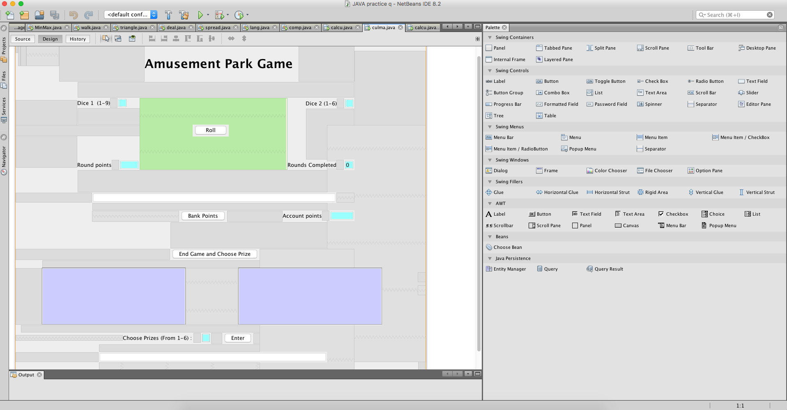
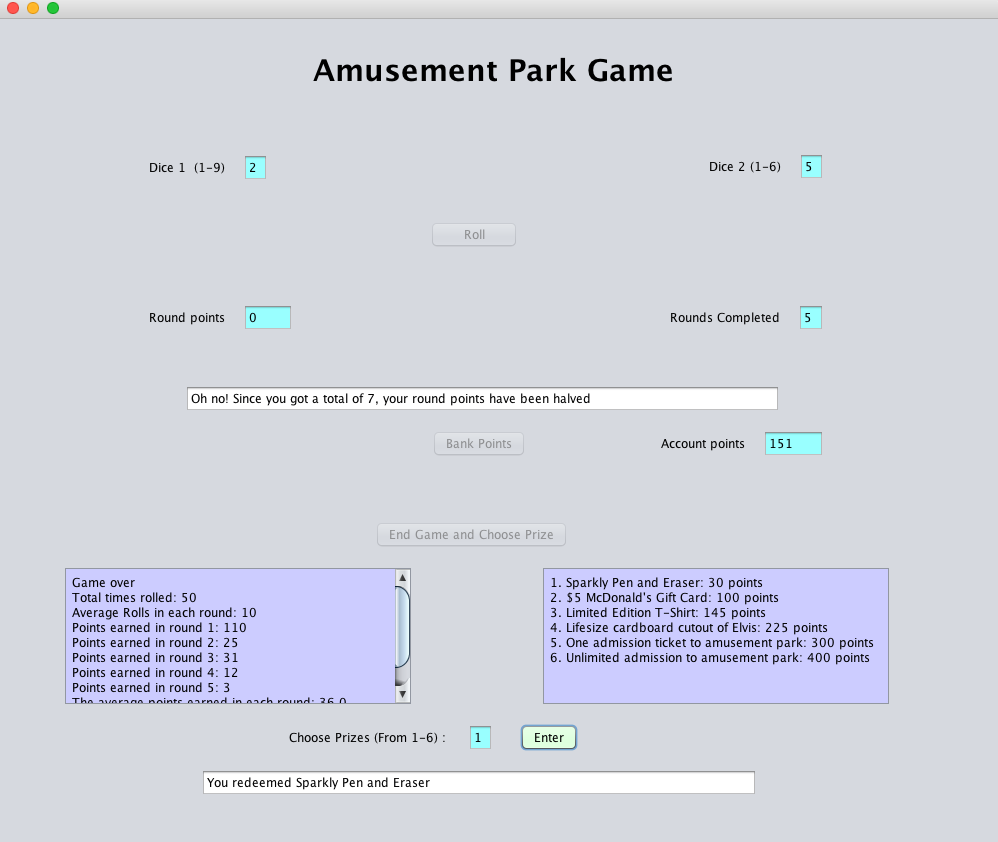

# Amusement Park Game

Hello everyone, this is a simple game amusement park companies can implement while users wait in line for their ride or use in the arcade. The game contains mainly GUI elements with the user simply clicking a few buttons and will be required to input a number when redeeming their prize. This game has been made so it runs completely random but with a few incentives and consequences if user keeps playing.

The player starts off by clicking on the Roll button to randomly generate two numbers from 1 - 6 and 1- 9 bounds respectively. These two numbers are then added together and deposited to the user's round total. The user can roll and deposit points to their account unlimited times during a round and can keep gaining points during a round. However, there are incentives and punishments to continue to roll.

To continue rolling:

- If you deposit more than 50 points at one time, then the points deposited is doubled
- If you deposit more than 75 points at one time, then the points deposited is tripled
- If you deposit more than 100 points at one time, then the points deposited is quadrupled

Consequences to continue rolling:

- If you roll a one on any of the two numbers, your round points get set to zero
- If the sum of your roll equals seven, then your round points gets cut in half
- If you roll both one's (Snake Eyes), then your round pount and your account points gets reset to zzero

After being satisfied with how many round points the user has, they can choose to bank the round points into their account points. There are five rounds in total, each accumulating the round points from before. After the five rounds, the game will be over and the buttons will be greyed out and a summary of the user statistics (average points earned, total number of rolls, etc.). The user can then choose their prize from the menu by indicating their choice number.

### Images

### Sample Video

